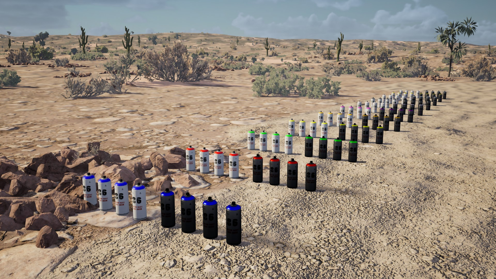

# SuperSprayPaint Mod for Drive Beyond Horizons

This mod allows you to spawn paint cans with various colors and finishes.



## Features

- Spawns 4 matte and 4 metallic versions of each color
- Organized grid layout for easy selection
- Simple one-key operation (F5)

## Usage

### Controls

1. Face the direction where you want the paint cans to appear
2. Press `F5` to instantly spawn all paint cans in a grid in front of your character
3. Each color will have two variants:
   - Matte finish (white cans)
   - Metallic finish (black cans)

### Available Colors

- Blue
- Red
- Green
- Yellow
- Orange
- Purple
- Pink
- Black
- White
- Gold
- Silver

### Available Sheen Types

- Matte - Flat, non-reflective finish
- Metallic - Shiny metallic finish

## Tutorial Video

[](https://www.youtube.com/watch?v=pWbKwe9b0e0)

## Installation

1. Make sure you have the most recent `experimental-latest` version of UE4SS installed into your Drive Beyond Horizons directory. [Download](https://github.com/UE4SS-RE/RE-UE4SS/releases/tag/experimental-latest)
   
`Drive Beyond Horizons\DriveBeyondHorizons\Binaries\Win64`

2. Place the SuperSprayPaintMod folder in your game's mods directory:
   
`Drive Beyond Horizons\DriveBeyondHorizons\Binaries\Win64\ue4ss\Mods\`

3. By default this mod will be enabled via enabled.txt in the mods folder. You can drop the mod in and and launch the game.

   There are two ways to enable/disable the mod:
   - **Method 1 (default)**: Create an empty file named `enabled.txt` in the SuperSprayPaintMod folder
     - This bypasses the need to edit mods.txt/mods.json
     - To disable and use the next method, simply delete this file.
   - **Method 2**: Add the mod to your `mods.txt` and/or `mods.json` file in the UE4SS Mods directory:

   mods.txt:
     ```
     SuperSprayPaintMod : 1
     ```
   mods.json:
     ```json
     {
       "SuperSprayPaintMod": true
     }
     ```
4. Launch the game and load into a map
5. Press F5 in-game to spawn the paint cans

## Known Issues

- The game saves normally, but if you try to exit via the in-game menu after spawning cans at least once, the game will crash. While it *is* annoying, it's relatively harmless.

## Troubleshooting

If you encounter issues:

1. Check the UE4SS console for error messages (requires zDEV-UE4SS install)
2. Make sure the mod is properly installed and enabled (either with enabled.txt or in mods.txt/mods.json)
3. If paint cans spawn in weird positions:
   - Make sure you're standing on relatively flat ground. Gas Stations and Repair Shops have the best flat ground.

## TODO

- Add more colors and finishes
- Increase paint amount per can
- Add method to clear spawned cans in an area relative to the player

## Credits

Special thanks to the UE4SS and Drive Beyond Horizons team for making modding possible.
